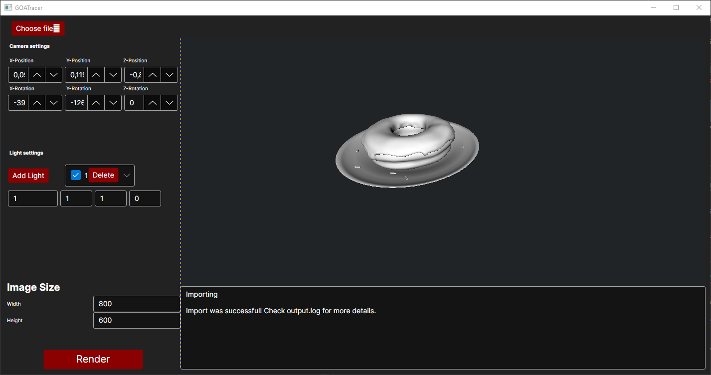

# GOATracer

A simple raytracer written in C#. This project combines a modern Avalonia UI with an OpenTK preview window.

This tool allows users to load 3D `.obj` models, change lighting in real-time and generate high-quality raytraced images with texture support.

## Table of Contents
- [Features](#features)
- [Installation](#installation)
- [Usage](#usage)
- [Contributing](#contributing)
- [License](#license)

## Features

- Built using the [Avalonia UI](https://avaloniaui.net/) framework to run cross-platform.
- Utilizes [OpenTK](https://opentk.net/) to provide a fast preview of the scene before raytracing.
- Support for loading `.obj` 3D model files.
- Texture mapping support visibile in both the OpenTK preview and the final raytraced output.
- Interactive lighting and camera controls.
- Lights can be defined, positioned and moved directly within the UI.


### Workflow
1. Load a model by using `Choose file` in the UI.
2. Setup the scene:
    - Navigate the scene using the OpenTK preview window:
        - It supports moving the camera with WASD.
        - Space to raise the camera. 
        - Shift to lower the camera. 
        - Rotating the camera is possible by clicking and dragging with the mouse inside the preview window.
        - Slow down camera speed with 'O' and speed up with 'P'.
    - Use the panel on the left side in the UI to add new lights.
    - Adjust light & camera positions using the X, Y, Z input fields. Changes will update in the preview immediately.
3. Click the "Render" button to begin the rendering process. The output will take into account the textures, camera position and lighting defined in the preview.



## Installation
### Linux (Debian/Ubuntu/Mint)

Download the latest `.deb` release. On most desktop environments, you can install the package simply by **double-clicking** the downloaded file.

Alternatively, you can install it via the terminal. This ensures all dependencies are resolved correctly:

1. Open a terminal in the folder containing the downloaded file.
2. Run the following command:

```bash
sudo apt install ./GOATracer-0.0.1-alpha.deb -y
```

The application will then install and can be opened from the distros application menu.

### Windows

Download the .msi installer.

Double-click the file to run the setup wizard.

> **Note:** If you receive a "Windows protected your PC" warning (SmartScreen), click on **"More info"** and then **"Run anyway"**. This happens because this is an alpha release and not digitally signed.

Follow the on-screen instructions to complete the installation.

After installation, GOATracer will be available in your Start Menu.


## Project Setup
Ensure you have the .NET SDK installed. .NET8.0 was used for development.
1. Clone the repository:
```bash
git clone https://github.com/acaimingus/GOATracer.git
cd GOATracer
```

2. Restore dependencies:
```bash
dotnet restore
```


3. Build the project:
```bash
dotnet build
```

### Usage

To run the application, run the following command in the terminal:

```bash
dotnet run
```


### Coding Standards
This project uses the [Google C# coding styleguide](https://google.github.io/styleguide/csharp-style.html) to maintain consistency.

## License
Distributed under the MIT License. See **[LICENSE](LICENSE.md)** for more information.